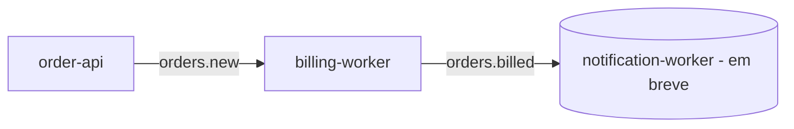

# jms-activemq-order-pipeline

> **Portfólio:** Este projeto faz parte do meu portfólio voltado a back-end Java, com foco em **mensageria (JMS/ActiveMQ)**, **processamento assíncrono** e **boas práticas de integração entre microsserviços**.

---

## 🧩 Arquitetura (em desenvolvimento)

Atualmente, o pipeline possui **duas etapas implementadas** e uma terceira planejada:

- 🟣 **order-api** → Serviço REST (Spring Boot Web + JMS) que expõe `POST /orders`, valida a carga e publica mensagens na fila **`orders.new`**.  
- 🟠 **billing-worker** → Worker JMS que consome **`orders.new`**, simula o faturamento (gera NF e `billedAt`) e publica em **`orders.billed`**.  
- 🟢 *(em breve)* **notification-worker** → Worker JMS que consumirá **`orders.billed`** e registrará notificações simuladas ao cliente.

📈 **Fluxo atual:**  
`order-api → orders.new → billing-worker → orders.billed`

🚧 **Próximo passo:**  
`notification-worker` para completar o pipeline de ponta a ponta.

---

## ⚙️ Stack

- ☕ **Java 17**  
- 🚀 **Spring Boot 3.x**  
- 💬 **ActiveMQ Classic** (`rmohr/activemq:5.15.9` via Docker Compose)  
- 📦 **JMS (spring-boot-starter-activemq)**  
- 🔧 **Maven Wrapper (mvnw)**  

---

## 🧱 Pré-requisitos

- Docker + Docker Compose  
- JDK 17  
- (Opcional) Maven instalado — os subprojetos já incluem Maven Wrapper  

---

## 🐋 Subindo o broker

Na pasta raiz:

```bash
docker-compose up -d
```

Acesse o painel do ActiveMQ:  
➡️ [http://localhost:8161](http://localhost:8161)  
*(usuário/senha padrão: `admin` / `admin`)*

---

## 🧠 Objetivo do projeto

Demonstrar o uso de **mensageria com JMS** em uma arquitetura **assíncrona e desacoplada**, onde cada serviço é responsável por uma etapa do processo:

1. **Produção de eventos** (`order-api`)
2. **Processamento e faturamento** (`billing-worker`)
3. **Notificação final** (`notification-worker`, em desenvolvimento)

---

## 📚 Conceitos abordados até o momento

- Produção e consumo de mensagens com **JmsTemplate** e **@JmsListener**  
- Conversão de mensagens usando **MappingJackson2MessageConverter**  
- Padrão **“publish → process → publish”** entre microsserviços  
- Integração de múltiplos serviços via **ActiveMQ em Docker**  
- Princípios de **API assíncrona** (retorno `202 Accepted`)  

---

## 🔜 Próximos passos

- Implementar o **notification-worker**  
- Adicionar logs estruturados e métricas básicas  
- Criar um diagrama visual de fluxo para documentação  

---

## 💡 Dica de execução rápida

1️⃣ **Suba o broker:**
```bash
docker-compose up -d
```

2️⃣ **Rode os serviços (em terminais separados):**
```bash
cd order-api && ./mvnw spring-boot:run
cd billing-worker && ./mvnw spring-boot:run
```

3️⃣ **Envie um pedido:**
```bash
curl -X POST http://localhost:8081/orders   -H "Content-Type: application/json"   -d '{
    "orderId": "ORD-001",
    "customerEmail": "cliente@example.com",
    "item": "Combo X",
    "quantity": 2
  }'
```

---

## 📊 Diagrama do fluxo atual



---

## 📌 Status atual

✅ order-api  
✅ billing-worker  
🕓 notification-worker *(em desenvolvimento)*

---

💬 *Feedbacks e sugestões são bem-vindos! Este projeto está sendo construído de forma incremental para reforçar o aprendizado sobre mensageria e arquitetura orientada a eventos.*

---

